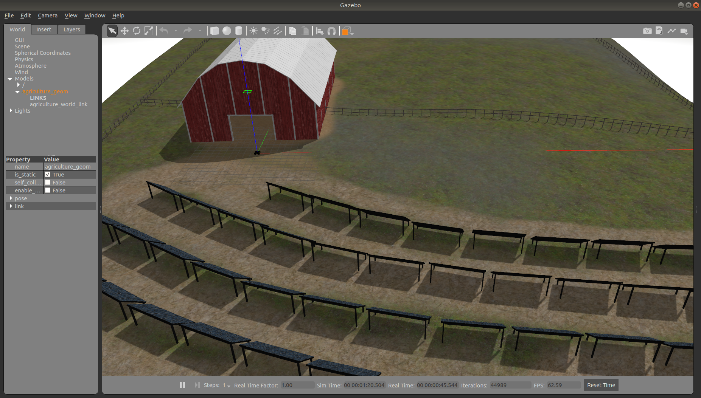
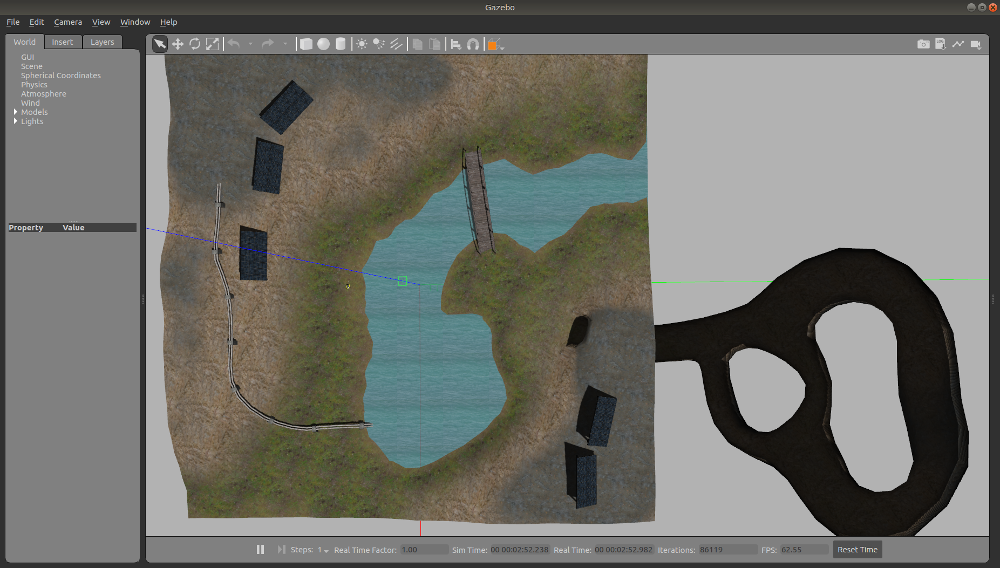
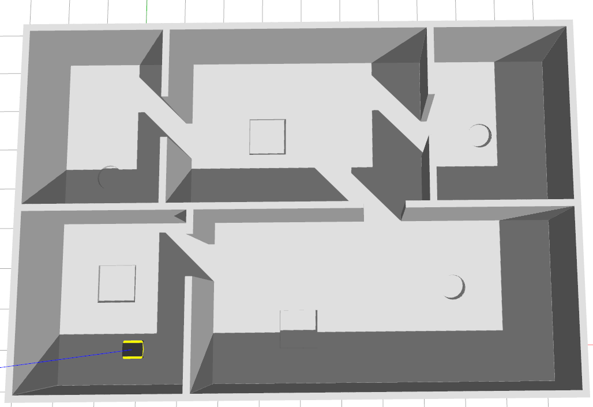
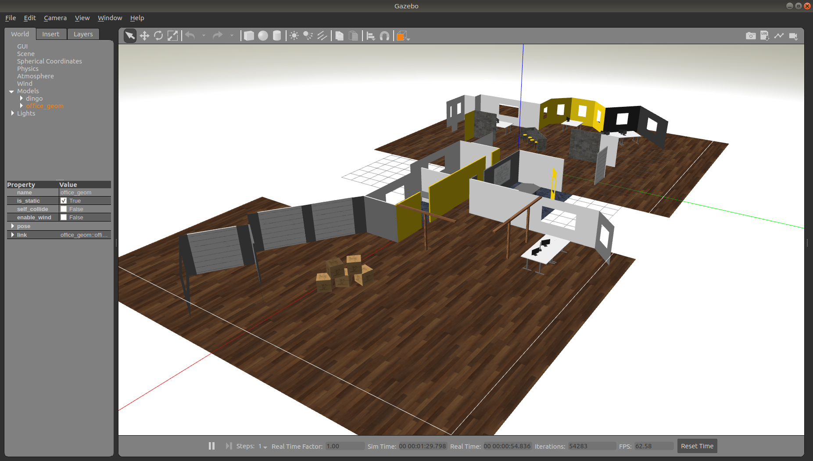
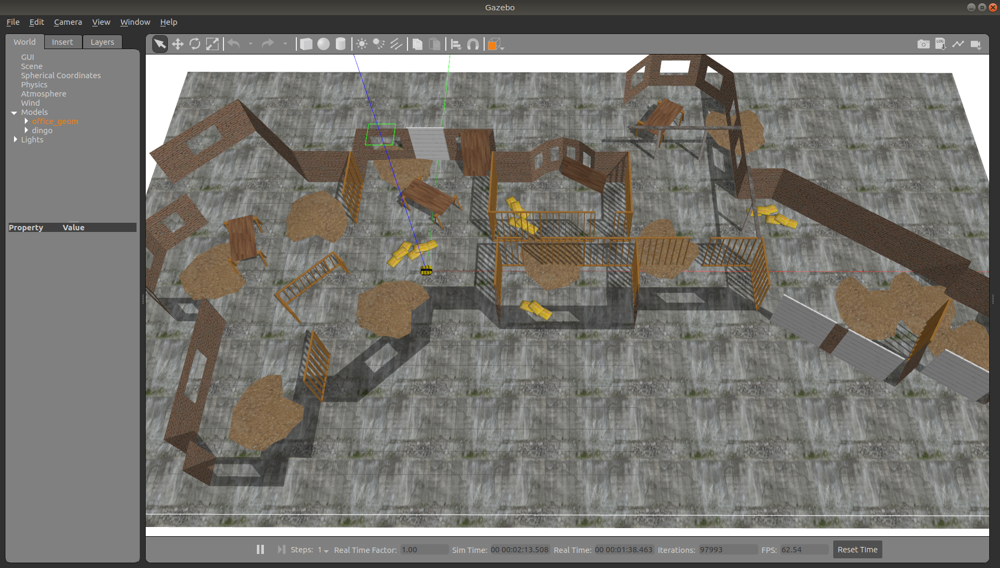

Clearpath Additional Simulation Worlds
==========================================

This repository contains additional indoor and outdoor simulation environments for use with Clearpath's robot platforms.

Launch Parameters
-------------------------------------------------------------

Each world has a launch file which will start the simulation environment with the appropriate robot.  These
launch files accept the following arguments:

Robot model:
- `platform`
The `platform` argument defaults to the `CPR_GAZEBO_PLATFORM` environment variable if it exists, otherwise a
size-appropriate robot is chosen as the default.  Each world supports different robots.  For example Dingo and Ridgeback
are not available on outdoor worlds.  Please refer to the specific world for supported robots.  Available robots for
any given world will be a subset of:
- `husky` (the most common default)
- `jackal`
- `warthog`
- `dingo`
- `ridgeback`
- `boxer`

Robot spawn position:
- `robot_x`
- `robot_y`
- `robot_z`
- `robot_yaw`
Most worlds default to (0, 0, 0.2, 0) as the initial (x, y, z, yaw) position, though some worlds may feature terrain or
other obstacles that necessitate a different default.  Please refer to the appropriate launch file for the default
spawn location for that world.

World spawn position:
- `world_x`
- `world_y`
- `world_z`
- `world_yaw`
All worlds default to (0, 0, 0, 0) as their spawn location.  If changing the world location, it may be necessary to
change the robot's spawn location as well, to prevent the robot from spawning in a location not above the ground plane.

Agriculture World
-------------------------------------------------------------

This is a flat, outdoor world with a barn, fences, and a medium-sized solar farm.

See [Agriculture World](cpr_agriculture_gazebo/docs/README.md)

Inspection World
-------------------------------------------------------------

This is a hilly, outdoor world featuring a bridge, cave/mine, water, small solar farm, and water pipes.

See [Inspection World](cpr_inspection_gazebo/docs/README.md)

Obstacle World
-------------------------------------------------------------

This world features an indoor, enclosed world with non-planar ground geometry:

See [Obstacle World](cpr_obstacle_gazebo/docs/README.md)

Office World
-------------------------------------------------------------

This world features two maps with the same general floorplan:

A small office featuring hallways, meeting rooms, and furniture.

The same office, but undergoing construction.  Construction materials are piled on the floor, and several walls are
only studs.

See [Office World](cpr_office_gazebo/docs/README.md)

Orchard World
-------------------------------------------------------------

This is a flat, outdoor world with several rows of small trees separated by dirt paths

[Orchard World](cpr_orchard_gazebo/docs/README.md)

Race Modules
-------------------------------------------------------------

This is not an actual environment, but rather a collection of concrete and dirt road segments that can be used
to build race tracks.

See [Race Modules](cpr_race_modules/docs/README.md)
