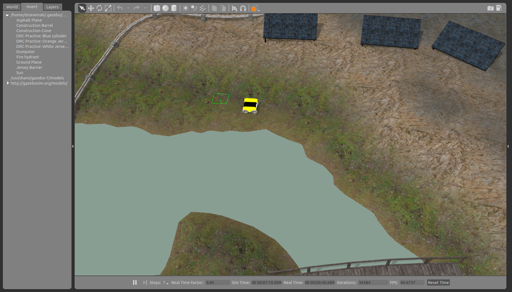
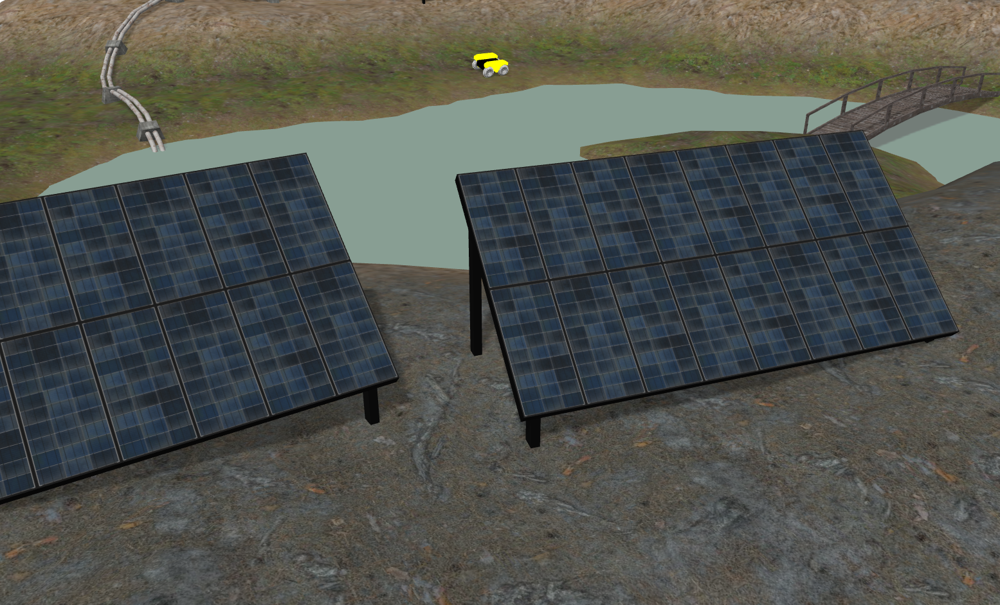
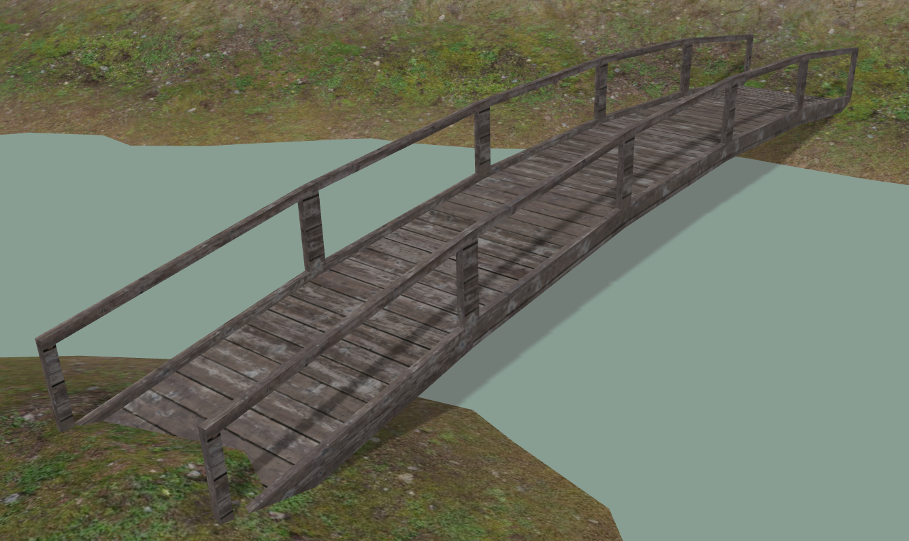
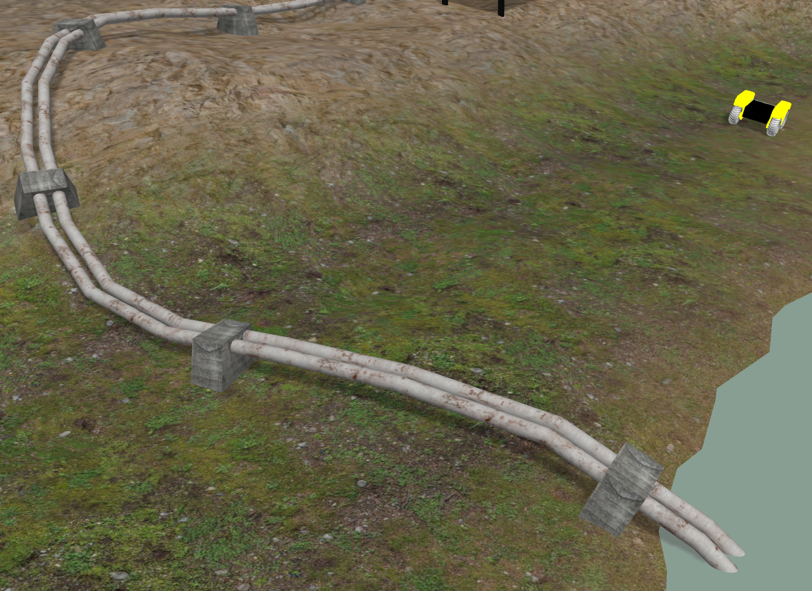
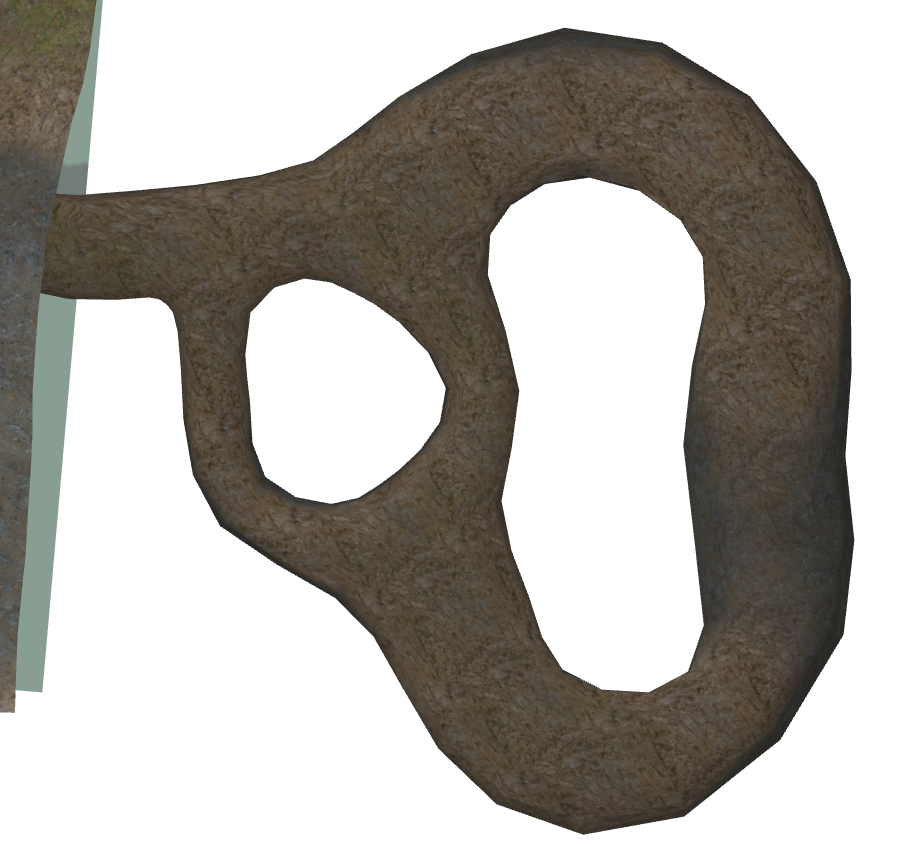
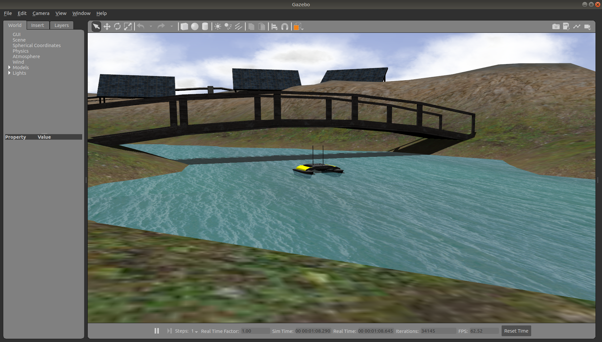

# cpr_inspection_gazebo

Outdoor simulation world for Gazebo



## Supported Platrofms

### Husky


[](
https://console.aws.amazon.com/cloudformation/home#/stacks/create/review?region=us-east-2&templateURL=https://cpr-gazebo-public.s3.us-east-2.amazonaws.com/CPR-Kinetic-Simulation-Stack.yaml&stackName=cpr-inspection-gazebo&param_SimWorld=cpr_inspection_gazebo&param_SimLaunch=inspection_world.launch&param_RoboticPlatform=husky)

### Jackal


[](
https://console.aws.amazon.com/cloudformation/home#/stacks/create/review?region=us-east-2&templateURL=https://cpr-gazebo-public.s3.us-east-2.amazonaws.com/CPR-Kinetic-Simulation-Stack.yaml&stackName=cpr-inspection-gazebo&param_SimWorld=cpr_inspection_gazebo&param_SimLaunch=inspection_world.launch&param_RoboticPlatform=jackal)

### Warthog


[](
https://console.aws.amazon.com/cloudformation/home#/stacks/create/review?region=us-east-2&templateURL=https://cpr-gazebo-public.s3.us-east-2.amazonaws.com/CPR-Kinetic-Simulation-Stack.yaml&stackName=cpr-inspection-gazebo&param_SimWorld=cpr_inspection_gazebo&param_SimLaunch=inspection_world.launch&param_RoboticPlatform=warthog)

## Launching

```
roslaunch cpr_inspection_gazebo inspection_world.launch
```

Optionally, you can specify a platform using the platform variable:

```
roslaunch cpr_inspection_gazebo inspection_world.launch platform:=jackal
```

Supported values for the platform variable are:
* husky (default)
* jackal
* warthog

The spawn location for the robot can be specified by setting the `x`, `y`, `z`, and `yaw` variables.  Note that some X/Y positions
may place the robot over the water feature instead of on dry land.  The Z value should be set to be above ground-level; otherwise
the robot may fall through the ground plane as the environment renders.

## Features

This is a large, open outdoor world for Gazebo that has:

### Solar Panels



### Bridge



### Pipeline



### Mine Tunnel



### Water physics


