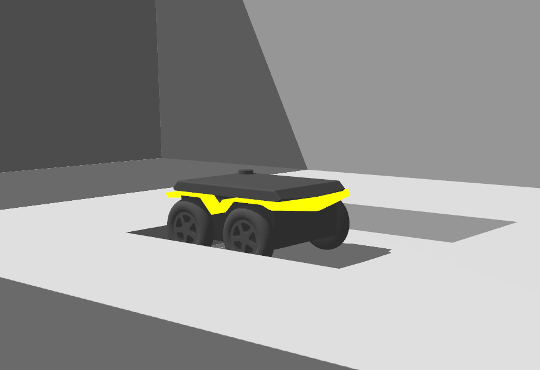
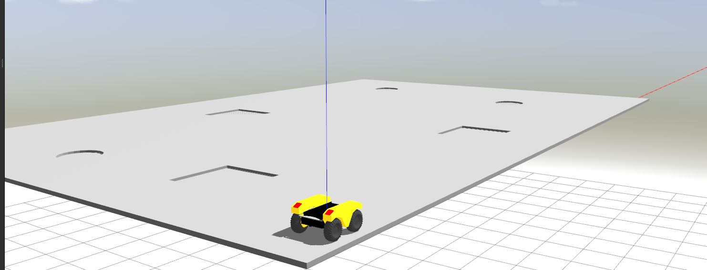

# cpr_obstacle_gazebo

Indoor simulation environment for Gazebo featuring holes in the floor, narrow doorways, and walls.

## Supported Platrofms

### Jackal


### Husky


### Dingo


### Warthog


## Obstacle World Launching

```roslaunch cpr_obstacle_gazebo obstacle_world.launch```

Optionally, you can specify a platform using the platform variable:

```roslaunch cpr_obstacle_gazebo obstacle_world.launch platform:=jackal```

Supported values for the platform variable are:
* jackal (default)
* husky
* dingo
* warthog (requires `world_scale` to be increased; see below)

The spawn location for the robot can be specified by setting the `x`, `y`, `z`, and `yaw` variables.  The Z value should be set
to be above ground-level; otherwise the robot may fall through the ground plane as the environment renders.

The X/Y scale can be set with the `world_scale` argument.  The default value is `1.0`, but can be increased or decreased
to change the size of the ground-plane.  When using large platforms, like Warthog, we recommend increasing the `world_scale`
to at least `2.0`.

The walls can be toggled on or off by setting the `walls` argument.  The default value is `true`.  The ground geometry
remains identical, whether walls are enabled or not.

## Features of the obstacle world

### Large rooms with narrow doorways between them


### Holes that may trap smaller robots if they drive into them


### Toggleable walls and adjustable scale

