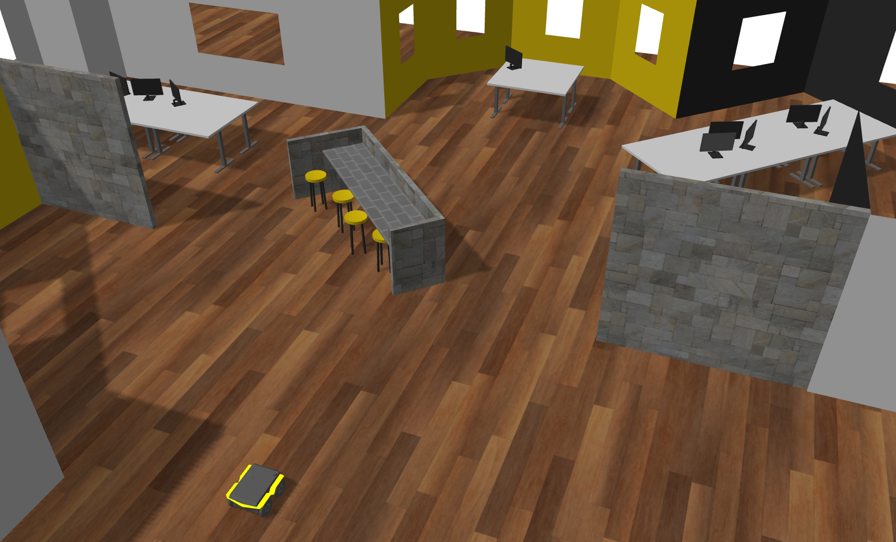
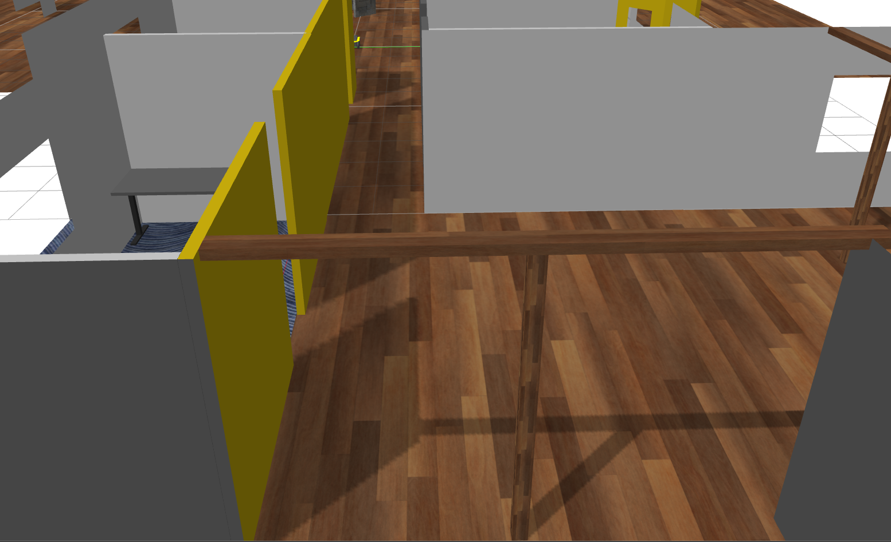
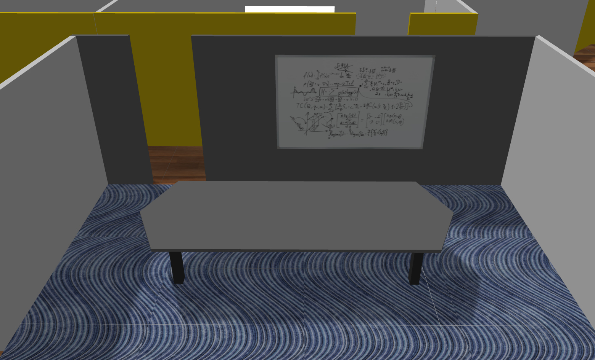
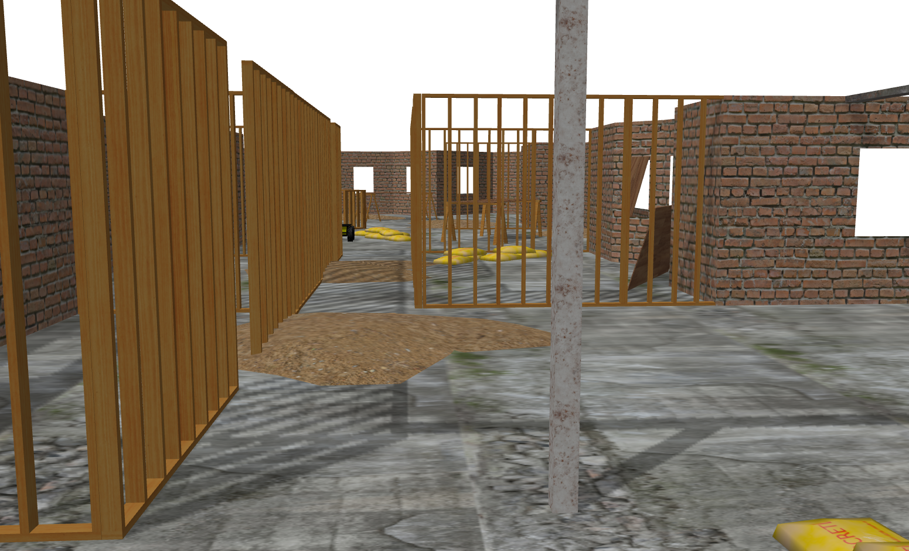
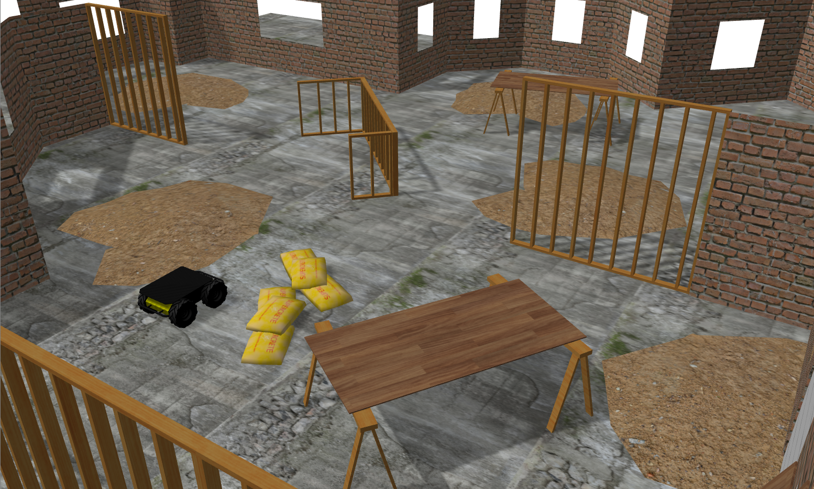
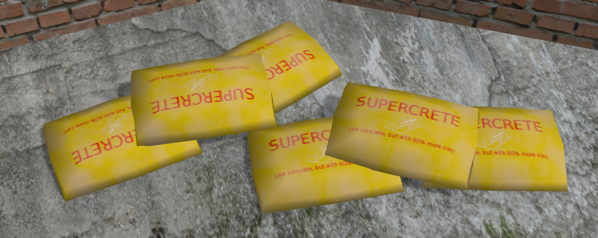

# cpr_office_gazebo

Indoor office simulation world for Gazebo including both completed and under-construction versions

## Supported Platrofms

### Jackal


Office | Office Construction
------ | -------------------
<a href="https://console.aws.amazon.com/cloudformation/home#/stacks/create/review?region=us-east-2&templateURL=https://cpr-gazebo-public.s3.us-east-2.amazonaws.com/CPR-Kinetic-Simulation-Stack.yaml&stackName=cpr-office-gazebo&param_SimWorld=cpr_office_gazebo&param_SimLaunch=office_world.launch&param_RoboticPlatform=jackal"></a> | <a href="https://console.aws.amazon.com/cloudformation/home#/stacks/create/review?region=us-east-2&templateURL=https://cpr-gazebo-public.s3.us-east-2.amazonaws.com/CPR-Kinetic-Simulation-Stack.yaml&stackName=cpr-office-construction-gazebo&param_SimWorld=cpr_office_gazebo&param_SimLaunch=office_construction_world.launch&param_RoboticPlatform=jackal"></a>

### Husky


Office | Office Construction
------ | -------------------
<a href="https://console.aws.amazon.com/cloudformation/home#/stacks/create/review?region=us-east-2&templateURL=https://cpr-gazebo-public.s3.us-east-2.amazonaws.com/CPR-Kinetic-Simulation-Stack.yaml&stackName=cpr-office-gazebo&param_SimWorld=cpr_office_gazebo&param_SimLaunch=office_world.launch&param_RoboticPlatform=husky"></a> | <a href="https://console.aws.amazon.com/cloudformation/home#/stacks/create/review?region=us-east-2&templateURL=https://cpr-gazebo-public.s3.us-east-2.amazonaws.com/CPR-Kinetic-Simulation-Stack.yaml&stackName=cpr-office-construction-gazebo&param_SimWorld=cpr_office_gazebo&param_SimLaunch=office_construction_world.launch&param_RoboticPlatform=husky"></a>

### Ridgeback


Office | Office Construction
------ | -------------------
<a href="https://console.aws.amazon.com/cloudformation/home#/stacks/create/review?region=us-east-2&templateURL=https://cpr-gazebo-public.s3.us-east-2.amazonaws.com/CPR-Kinetic-Simulation-Stack.yaml&stackName=cpr-office-gazebo&param_SimWorld=cpr_office_gazebo&param_SimLaunch=office_world.launch&param_RoboticPlatform=ridgeback"></a> | <a href="https://console.aws.amazon.com/cloudformation/home#/stacks/create/review?region=us-east-2&templateURL=https://cpr-gazebo-public.s3.us-east-2.amazonaws.com/CPR-Kinetic-Simulation-Stack.yaml&stackName=cpr-office-construction-gazebo&param_SimWorld=cpr_office_gazebo&param_SimLaunch=office_construction_world.launch&param_RoboticPlatform=ridgeback"></a>

### Dingo


Office | Office Construction
------ | -------------------
<a href="https://console.aws.amazon.com/cloudformation/home#/stacks/create/review?region=us-east-2&templateURL=https://cpr-gazebo-public.s3.us-east-2.amazonaws.com/CPR-Kinetic-Simulation-Stack.yaml&stackName=cpr-office-gazebo&param_SimWorld=cpr_office_gazebo&param_SimLaunch=office_world.launch&param_RoboticPlatform=dingo"></a> | <a href="https://console.aws.amazon.com/cloudformation/home#/stacks/create/review?region=us-east-2&templateURL=https://cpr-gazebo-public.s3.us-east-2.amazonaws.com/CPR-Kinetic-Simulation-Stack.yaml&stackName=cpr-office-construction-gazebo&param_SimWorld=cpr_office_gazebo&param_SimLaunch=office_construction_world.launch&param_RoboticPlatform=dingo"></a>

## Complete Launching

```roslaunch cpr_office_gazebo office_world.launch```

Optionally, you can specify a platform using the platform variable:

```roslaunch cpr_office_gazebo office_world.launch platform:=jackal```

Supported values for the platform variable are:
* husky (default)
* jackal
* ridgeback
* dingo

The spawn location for the robot can be specified by setting the `x`, `y`, `z`, and `yaw` variables.  The Z value should be set
to be above ground-level; otherwise the robot may fall through the ground plane as the environment renders.

## Features of the complete office world

### Large, open areas


### Narrow hallways


### Meeting rooms & offices


## Construction Launching

```roslaunch cpr_office_gazebo office_construction_world.launch```

Optionally, you can specify a platform using the platform variable:

```roslaunch cpr_office_gazebo office_construction_world.launch platform:=jackal```

Supported values for the platform variable are:
* husky (default)
* jackal
* ridgeback
* dingo

The spawn location for the robot can be specified by setting the `x`, `y`, `z`, and `yaw` variables.  The Z value should be set
to be above ground-level; otherwise the robot may fall through the ground plane as the environment renders.

## Features of the construction world

### Incomplete walls


### Different ground textures


### Construction-oriented debris & obstacles

